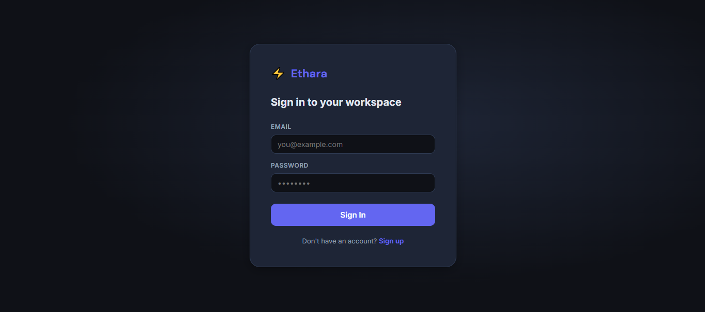
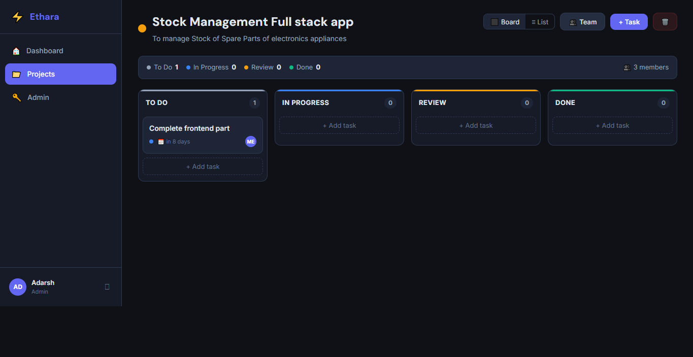
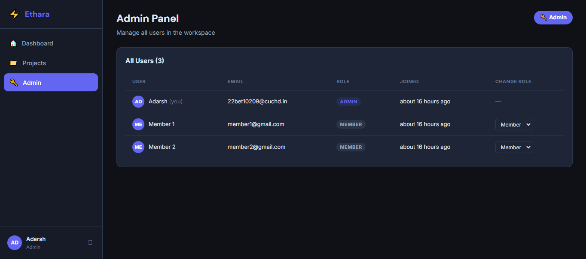

<div align="center">

# ⚡ Ethara 

### Full-Stack Team Task Manager with Role-Based Access Control

[](https://nodejs.org)
[](https://react.dev)
[](https://expressjs.com)
[](https://vitejs.dev)
[](https://railway.app)

**[🌐 Live Demo](#)** &nbsp;·&nbsp; **[📹 Demo Video](#)** &nbsp;·&nbsp; **[🐛 Report Bug](../../issues)** &nbsp;·&nbsp; **[✨ Request Feature](../../issues)**

</div>

---

## 📌 Table of Contents

- [About the Project](#-about-the-project)
- [Features](#-features)
- [Tech Stack](#-tech-stack)
- [Project Structure](#-project-structure)
- [Getting Started](#-getting-started)
- [Environment Variables](#-environment-variables)
- [API Reference](#-api-reference)
- [Role-Based Access Control](#-role-based-access-control)
- [Deployment on Railway](#-deployment-on-railway)
- [Screenshots](#-screenshots)
- [Author](#-author)

---

## 🧩 About the Project

**Ethara** is a production-ready, full-stack team project management application. It allows teams to create projects, manage members, assign and track tasks through a visual Kanban board, and monitor progress through a real-time dashboard — all protected by JWT authentication and a robust role-based access system.

> 💡 **First registered user automatically becomes the Admin.** All subsequent signups are Members.

---

## ✨ Features

### 🔐 Authentication
- Secure **Signup & Login** with JWT tokens (7-day expiry)
- Passwords hashed with **bcryptjs** (12 salt rounds)
- Protected routes — unauthenticated users are auto-redirected to login
- Persistent login via `localStorage`

### 👥 Role-Based Access Control (RBAC)
- **Global Roles:** `admin` / `member`
- **Project-Level Roles:** `admin` / `member` per project
- First registered user becomes global Admin automatically
- Admins can view all projects and manage all users

### 📁 Project Management
- Create projects with **name, description, color tag, and due date**
- **Click-to-edit** project title and description inline
- Project **progress bar** (completed tasks / total)
- Status tracking: `active` / `archived`
- Delete projects (cascades to all tasks and members)

### ✅ Task Management
- **Kanban Board** with drag-and-drop between columns
- **List View** for tabular task overview
- Task fields: Title, Description, Status, Priority, Assignee, Due Date, Tags
- Quick task creation per Kanban column
- Full task detail modal with inline editing
- **Comments** on tasks with timestamps and author avatars

### 👥 Members Management
- Dedicated **Members tab** inside each project
- **Live search** — type a name to find registered users instantly
- Add members by email address
- Member cards: assigned tasks, completed, active, overdue stats
- Per-member **progress bar**
- Change member role (Admin ↔ Member) from the card
- Remove members from project

### 📊 Dashboard
- Stats: Total projects, My Tasks, Overdue count, Completed today
- **Overdue task alerts** with red highlights
- Task status breakdown with progress bars
- My assigned tasks list with project context
- Recent projects quick-access

### 🔑 Admin Panel
- View all registered users in the workspace
- Promote / demote users between `admin` and `member`

---

## 🛠 Tech Stack

| Layer | Technology | Purpose |
|-------|-----------|---------|
| **Frontend** | React 19 + Vite 8 | UI framework & build tool |
| **Routing** | React Router v7 | Client-side navigation |
| **HTTP Client** | Axios | API calls with JWT interceptor |
| **Notifications** | React Hot Toast | Toast notifications |
| **Date Handling** | date-fns | Relative times & formatting |
| **Backend** | Node.js + Express 5 | REST API server |
| **Authentication** | JSON Web Tokens (JWT) | Stateless authentication |
| **Passwords** | bcryptjs | Secure password hashing |
| **Validation** | express-validator | Input validation & sanitization |
| **Database** | JSON File (custom driver) | Zero-config, zero native deps |
| **ID Generation** | uuid v4 | Unique IDs for all records |
| **Logging** | morgan | HTTP request logging |
| **Deployment** | Railway | Cloud hosting |
| **Styling** | Pure CSS + CSS Variables | Dark theme design system |

---

## 📁 Project Structure

```
taskflow/
│
├── 📂 backend/
│   ├── 📂 src/
│   │   ├── 📄 app.js                  # Express server — routes, CORS, static files
│   │   ├── 📄 db.js                   # Custom JSON file database
│   │   ├── 📂 middleware/
│   │   │   └── 📄 auth.js             # JWT verify · requireAdmin · requireProjectAccess
│   │   └── 📂 routes/
│   │       ├── 📄 auth.js             # Signup · Login · /me
│   │       ├── 📄 projects.js         # Project CRUD + member management
│   │       ├── 📄 tasks.js            # Task CRUD + comments
│   │       └── 📄 users.js            # User list · search · role change · dashboard
│   ├── 📂 data/
│   │   └── 📄 db.json                 # Auto-created on first run
│   ├── 📄 .env.example
│   └── 📄 package.json
│
├── 📂 frontend/
│   ├── 📂 src/
│   │   ├── 📂 api/
│   │   │   └── 📄 axios.js            # Axios instance + JWT header interceptor
│   │   ├── 📂 context/
│   │   │   └── 📄 AuthContext.jsx     # Global auth state: user · login · signup · logout
│   │   ├── 📂 components/
│   │   │   ├── 📄 Sidebar.jsx         # Navigation sidebar with user info
│   │   │   └── 📄 ProtectedLayout.jsx # Route guard — redirects unauthenticated users
│   │   ├── 📂 pages/
│   │   │   ├── 📄 AuthPage.jsx        # Login + Signup combined page
│   │   │   ├── 📄 Dashboard.jsx       # Stats · overdue alerts · recent projects
│   │   │   ├── 📄 Projects.jsx        # Project grid with create modal
│   │   │   ├── 📄 ProjectDetail.jsx   # Board · List · Members tabs + task modals
│   │   │   └── 📄 Admin.jsx           # User management (admin only)
│   │   ├── 📄 App.jsx                 # Router with protected routes
│   │   ├── 📄 main.jsx                # React entry point
│   │   └── 📄 index.css              # Complete dark theme design system
│   ├── 📄 index.html
│   └── 📄 vite.config.js             # Dev server proxy /api → localhost:3001
│
├── 📄 railway.toml                    # One-click Railway deployment config
├── 📄 package.json                    # Root-level scripts
└── 📄 README.md
```

---

## 🚀 Getting Started

### Prerequisites

- **Node.js** v18+
- **npm** v8+

### 1 — Clone the Repository

```bash
git clone https://github.com/adarshmaurya9919/team-task-manager.git
cd taskflow
```

### 2 — Set Up the Backend

```bash
cd backend
npm install
cp .env.example .env
```

Edit `.env` and set a strong JWT secret:

```env
PORT=3001
JWT_SECRET=replace_this_with_a_long_random_64_character_string
```

Start the backend:

```bash
node src/app.js
# 🚀 Ethara API running on port 3001
```

### 3 — Set Up the Frontend

Open a **second terminal**:

```bash
cd frontend
npm install
npm run dev
# ➜  Local:   http://localhost:5173
```

### 4 — Open the App

Visit **team-task-manager-production-1699.up.railway.app**

> Register your first account — it will automatically receive **Admin** privileges.

---

## 🔑 Environment Variables

Create a `.env` file inside the `backend/` folder (copy from `.env.example`):

| Variable | Required | Default | Description |
|----------|----------|---------|-------------|
| `PORT` | No | `3001` | Port the API server listens on |
| `JWT_SECRET` | **Yes** | — | Secret for signing JWT tokens — use a long random string |
| `NODE_ENV` | No | `development` | Set to `production` when deploying |

---

## 📡 API Reference

All protected routes require this HTTP header:
```
Authorization: Bearer <your_jwt_token>
```

### 🔐 Auth Endpoints

| Method | Endpoint | Auth | Description |
|--------|----------|------|-------------|
| `POST` | `/api/auth/signup` | — | Register a new user |
| `POST` | `/api/auth/login` | — | Login — returns JWT + user object |
| `GET` | `/api/auth/me` | JWT | Get currently logged-in user |

### 📁 Project Endpoints

| Method | Endpoint | Auth | Description |
|--------|----------|------|-------------|
| `GET` | `/api/projects` | JWT | List all accessible projects |
| `POST` | `/api/projects` | JWT | Create a new project |
| `GET` | `/api/projects/:id` | Member | Get project details, tasks, and members |
| `PUT` | `/api/projects/:id` | Member | Update project name, description, color, status |
| `DELETE` | `/api/projects/:id` | Member | Delete project and all its tasks |
| `POST` | `/api/projects/:id/members` | Member | Add a member by email address |
| `DELETE` | `/api/projects/:id/members/:userId` | Member | Remove a member from project |

### ✅ Task Endpoints

| Method | Endpoint | Auth | Description |
|--------|----------|------|-------------|
| `GET` | `/api/projects/:pid/tasks` | Member | List all tasks in a project |
| `POST` | `/api/projects/:pid/tasks` | Member | Create a new task |
| `PUT` | `/api/projects/:pid/tasks/:tid` | Member | Update task (status, priority, assignee…) |
| `DELETE` | `/api/projects/:pid/tasks/:tid` | Member | Delete a task |
| `GET` | `/api/projects/:pid/tasks/:tid/comments` | Member | Get all comments on a task |
| `POST` | `/api/projects/:pid/tasks/:tid/comments` | Member | Post a comment on a task |

### 👤 User Endpoints

| Method | Endpoint | Auth | Description |
|--------|----------|------|-------------|
| `GET` | `/api/users` | Admin | List all registered users |
| `GET` | `/api/users/search?q=` | JWT | Search users by name or email |
| `PATCH` | `/api/users/:id/role` | Admin | Change a user's global role |
| `GET` | `/api/users/dashboard` | JWT | Get dashboard stats and task data |

---

## 🛡 Role-Based Access Control

### Global Roles

| Permission | Admin | Member |
|-----------|:-----:|:------:|
| View all projects in workspace | ✅ | ❌ |
| Access Admin panel | ✅ | ❌ |
| Change any user's global role | ✅ | ❌ |
| Create new projects | ✅ | ✅ |

### Project-Level Roles

| Permission | Project Admin | Project Member |
|-----------|:-------------:|:--------------:|
| View project, tasks, members | ✅ | ✅ |
| Create and edit tasks | ✅ | ✅ |
| Comment on tasks | ✅ | ✅ |
| Add / remove members | ✅ | ❌ |
| Update project name / settings | ✅ | ❌ |
| Delete project | ✅ | ❌ |

---

## 🚂 Deployment on Railway

### Step 1 — Push to GitHub

```bash
git init
git add .
git commit -m "feat: initial commit — Ethara full-stack app"
git branch -M main
git remote add origin https://github.com/YOUR_USERNAME/taskflow.git
git push -u origin main
```

### Step 2 — Create Railway Project

1. Go to **[railway.app](https://railway.app)** → **New Project**
2. Click **Deploy from GitHub repo** → select your `Ethara` repository
3. Railway will detect `railway.toml` automatically

### Step 3 — Add Environment Variables

In Railway dashboard → your service → **Variables** tab:

```
JWT_SECRET=your_very_long_random_secret_64_chars_minimum
NODE_ENV=production
```

### Step 4 — Deploy

Click **Deploy**. Railway will run:
```bash
# Build step
cd frontend && npm install && npm run build
cd ../backend && npm install

# Start step
cd backend && node src/app.js
```

The Express backend automatically serves the compiled React frontend from `frontend/dist/`.

Your app will be live at `team-task-manager-production-1699.up.railway.app` 🎉

---

## 📸 Screenshots

### 🔐 Login Page


### 🏠 Home Page


### 📊 Admin


| Page | Description |
|------|-------------|
| **Login / Signup** | Clean auth form — first user becomes Admin |
| **Dashboard** | Stats overview, overdue alerts, recent projects |
| **Projects Grid** | Color-coded project cards with progress bars |
| **Kanban Board** | Drag-and-drop task columns (To Do → Done) |
| **List View** | Tabular task view with sorting |
| **Members Tab** | Member cards with task stats and role management |
| **Admin Panel** | User list with role management |

---

## 🧪 Quick Test Flow

After running locally:

1. **Register** at `/login` → first account = Admin
2. Open an incognito window → **Register** a second account = Member
3. Back as Admin → **Create a Project** → go into it
4. Click **👥 Members tab** → add the Member's email
5. Create some tasks → drag them between Kanban columns
6. Click **Admin** in sidebar → see both users, change roles
7. Open **/api/health** to verify the backend is running

---

## 📄 License

Distributed under the **MIT License**.

```
MIT License — Copyright (c) 2026 Adarsh
Permission is hereby granted, free of charge, to any person obtaining a copy
of this software to deal in the Software without restriction.
```

---

## 👨‍💻 Author

**Adarsh Maurya**

- 🎓 22BET10209 — Chandigarh University
- 📧 Email: 22BET10209@cuchd.in
- 🐙 GitHub: [@adarshmaurya9919](https://github.com/adarshmaurya9919)

---

<div align="center">

Built with ❤️ using React + Node.js

⭐ **If this project helped you, please give it a star!**

</div>
